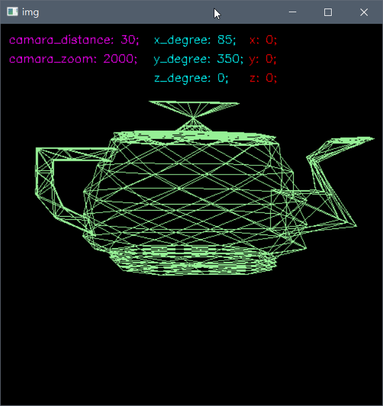

# Computer Graphics 電腦圖學

|  |  |
|:------------------------------------------------:|:------------------------------------------------:|
|                      Source                      |                      Bezier                      |

此圖為電腦圖學中著名的猶他茶壺（Utah teapot），由點（vertex）與面（face）構成，一個面由 16 個點組成，原始檔案經轉換成 python list 後為 [teapot.py](./model/teapot.py)。

## Description

使用 opencv-python 學習電腦圖學，包含以下主題：

- Projection: Parallel vs. Prospective
- Translations & Rotations
- Modeling
    - Use triangle and quadrangles
    - Bezier Curves
        - Recursive Subdivision
- Lighting
    - Shading
        - Flat Shading
        - Gouraud Shading
        - Phong Shading

## Known issues

1. 4/11: \[Modeling] triangle and quadrangles splitting methods. (Solve at 4/16)
2. 4/11: Lighting Uncompleted

## Reference

- https://youtu.be/QD4r4SMQMu4